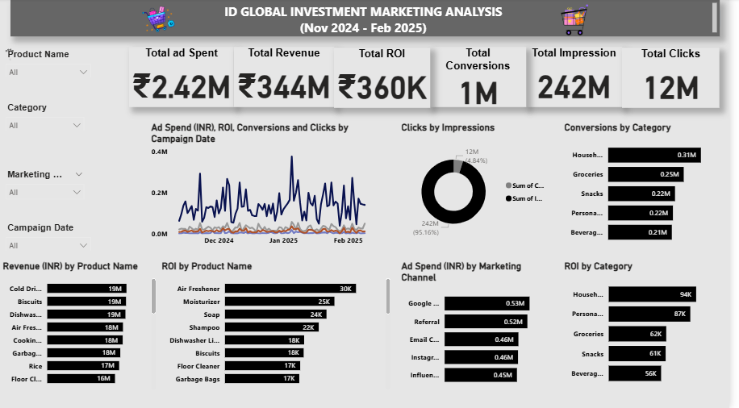

# Marketing Campaign Analysis Dashboard (Power BI)  

ID GLOBAL is a company that runs digital 
marketing campaigns across different channels: Email, Instagram Ads, 
Influencer Marketing, and more. In this project I built a fully interactive 
dashboard to monitor campaign performance and help optimize future 
strategies. I built a clean, professional dashboard that 
clearly communicates key insights and allows for dynamic filtering across 
campaigns, dates, products, and marketing channels. 

---

## Project Overview  
- Built an **interactive Power BI dashboard** to track key sales metrics.  
- Analyzed **revenue trends, product performance, and regional growth**.  
- Delivered actionable recommendations for business improvement.  

---

## Tools & Skills  
- **Power BI** → Data modeling & dashboard design  
- **DAX** → Calculated columns & measures  
- **Data Cleaning** → Prepared raw datasets for reporting  

---

## Dashboard Preview  
  

---

## How to Explore  
- Download the `.pbix` file and open it with **Power BI Desktop**.  
- View the PDF report for a summary of findings and visualizations.  
  

